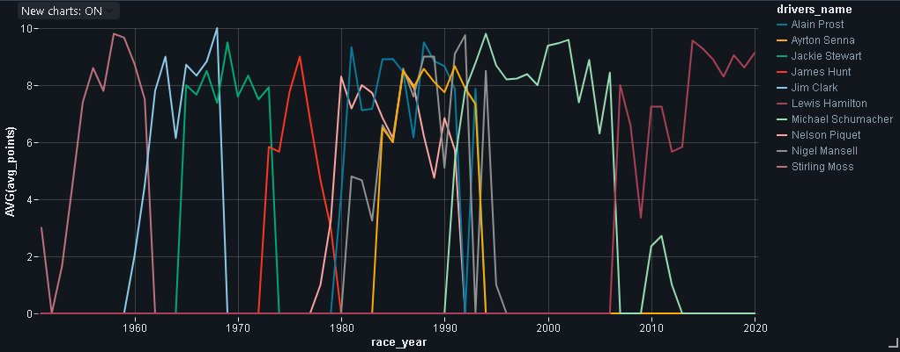

# Azure Data Lake Storage (ADLS) Access, Data Ingestion, Presentation, and Analysis

This project demonstrates various methods to access Azure Data Lake Storage (ADLS), perform data ingestion tasks, present insights, and conduct analysis within an Azure environment. Each folder contains a specific approach or task.

## Folder Set-Up

1. **1_access_adls_using_access_keys**  
2. **2_access_adls_using_sas_token**  
3. **3_access_adls_using_service_principal**  
4. **4_access_adls_using_cluster_scoped_credentials**  
5. **5_explore_dbutils_secrets_utility**  
6. **6_access_adls_using_secrets**  
7. **7_access_adls_using_secret_sas_token**  
8. **8_explore_dbfs_root**  
9. **9_mount_adls_using_service_principal**  
10. **10_mount_adls_containers_for_project**  

## Folder Ingestion

0. **0_ingest_all_files**  
1. **1_ingest_circuits_file**  
2. **2_ingest_races_file**  
3. **3_ingest_construct_file**  
4. **4_ingest_drivers_file**  
5. **5_ingest_results_file**  
6. **6_ingest_pitstop_file**  
7. **7_ingest_laptimes_file**  
8. **8_ingest_qualifying_file**  

## Folder Presentation

1. **1_race_results**  
2. **2_driver_standings**  
3. **3_constructors_standing**  
4. **4_calculated_race_results_py**  
5. **5_calculated_race_results_sql**  

## Folder Includes

- **common_functions**  
- **configuration**  

## Folder Analysis

1. **1_find_dominant_drivers**  
2. **2_find_dominant_teams**  
