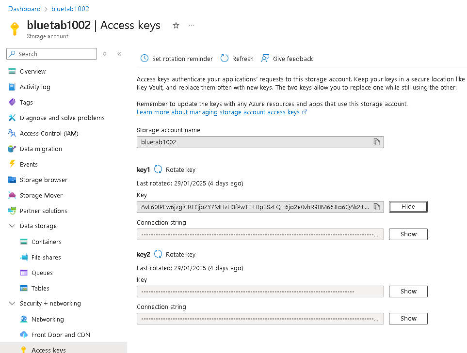
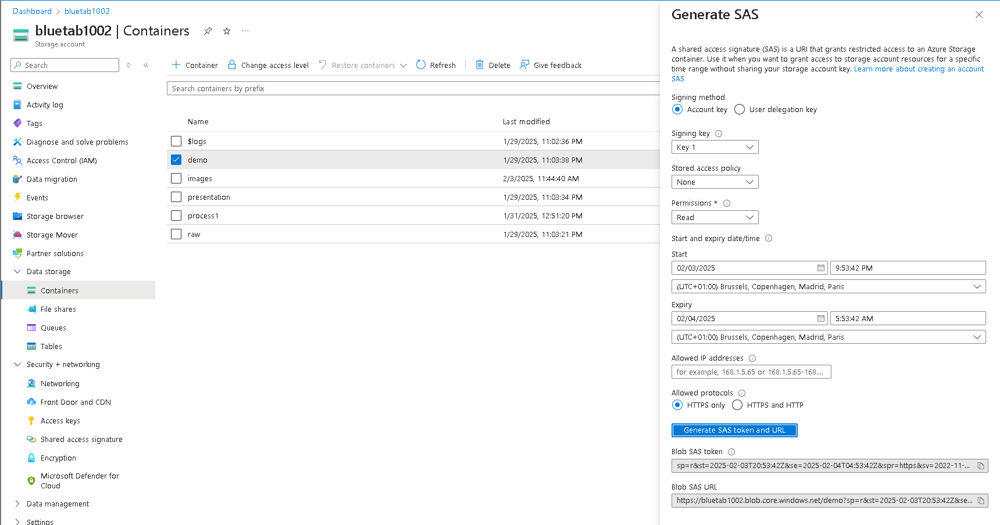
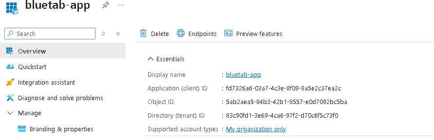
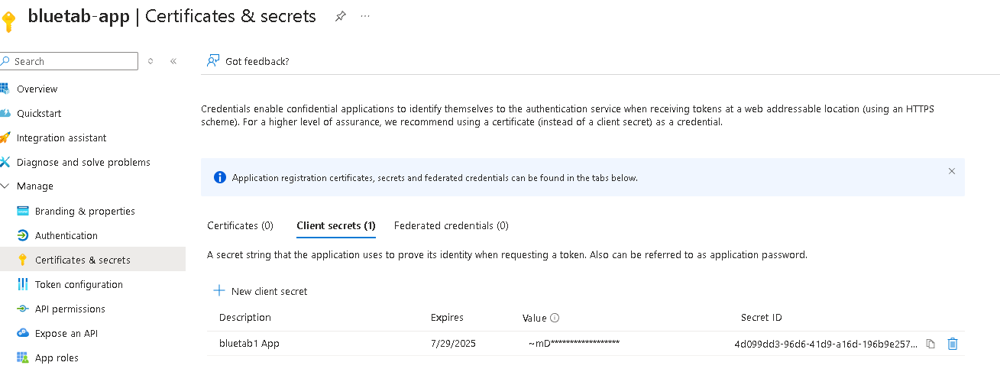
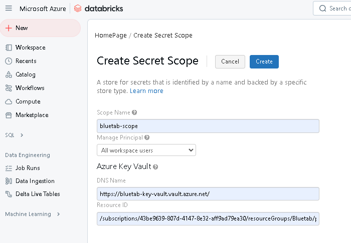
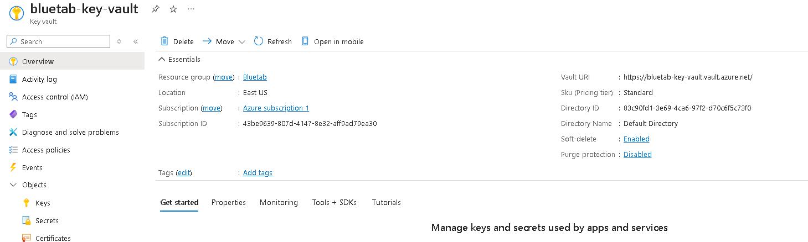
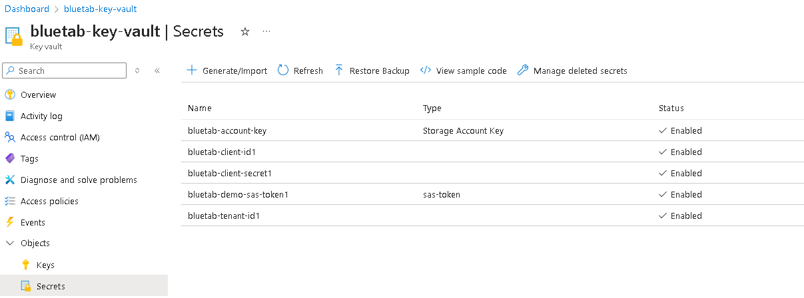
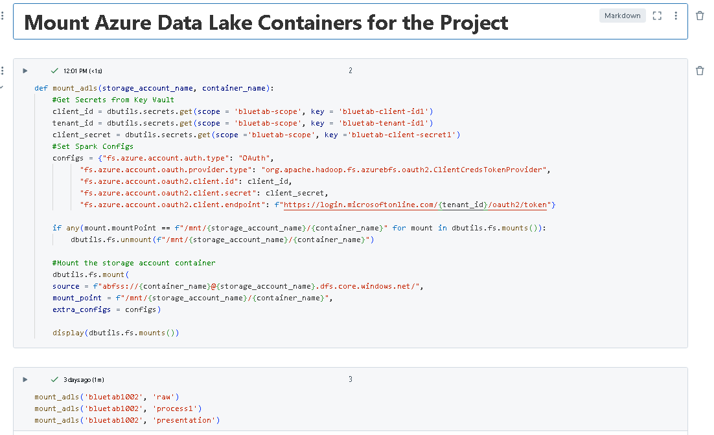

# Azure Data Lake Storage (ADLS) Project

This project demonstrates various methods to access Azure Data Lake Storage (ADLS) and perform data ingestion, presentation, and analysis tasks using **Databricks**, **Key Vaults**, **Entra ID**, **Storage Accounts**, **Data Factory**, **Cost Management**, **Python**, **PySpark**, and **SQL**.

---

## Technologies Used

- **Databricks**: For data processing and analysis.
- **Key Vaults**: For securely storing and managing secrets.
- **Entra ID**: For authentication and access management.
- **Storage Account**: For storing data in ADLS.
- **Data Factory**: For orchestrating data pipelines.
- **Cost Management**: For monitoring and optimizing costs.
- **Python**: For scripting and data processing.
- **PySpark**: For distributed data processing in Databricks.
- **SQL**: For querying and analyzing structured data.

## Project Structure

### Folder Set-Up

1. **1_access_adls_using_access_keys**

2. **2_access_adls_using_sas_token**

3. **3_access_adls_using_service_principal** 

 

4. **4_access_adls_using_cluster_scoped_credentials**  
5. **5_explore_dbutils_secrets_utility**  
6. **6_access_adls_using_secrets**  
7. **7_access_adls_using_secret_sas_token**  
8. **8_explore_dbfs_root**  
9. **9_mount_adls_using_service_principal**  
10. **10_mount_adls_containers_for_project**

 

  

### Folder Ingestion
The Ingestion Folder focuses on the process of extracting, transforming, and loading (ETL) data from various file formats—such as CSV, JSON, and bulk files—into Azure Data Lake Storage (ADLS). Using PySpark within Databricks, the data was efficiently read from ADLS, transformed to meet project requirements, and then written back to ADLS in a structured format for further analysis. The ingestion process handled a variety of file types, including single CSV and JSON files, as well as multiple CSV and JSON files for bulk ingestion. Authentication and secure access to ADLS were managed through Azure Key Vault, ensuring that sensitive credentials were securely stored and retrieved. This was a simple project with relatively small datasets, and the main objective was to gain hands-on experience working within the Azure environment, leveraging tools like Databricks, ADLS, and Key Vault to build a streamlined ETL workflow. All files used in this process are located in the adls folder within this GitHub repository.
0. **0_ingest_all_files**  
1. **1_ingest_circuits_file**  
2. **2_ingest_races_file**  
3. **3_ingest_construct_file**  
4. **4_ingest_drivers_file**  
5. **5_ingest_results_file**  
6. **6_ingest_pitstop_file**  
7. **7_ingest_laptimes_file**  
8. **8_ingest_qualifying_file**

 

### Folder Presentation

1. **1_race_results**  
2. **2_driver_standings**  
3. **3_constructors_standing**  
4. **4_calculated_race_results_py**  
5. **5_calculated_race_results_sql**  

### Folder Includes

- **common_functions**: Shared utility functions.
- **configuration**: Configuration files for the project.

### Folder Analysis

1. **1_find_dominant_drivers**  
2. **2_find_dominant_teams**  
